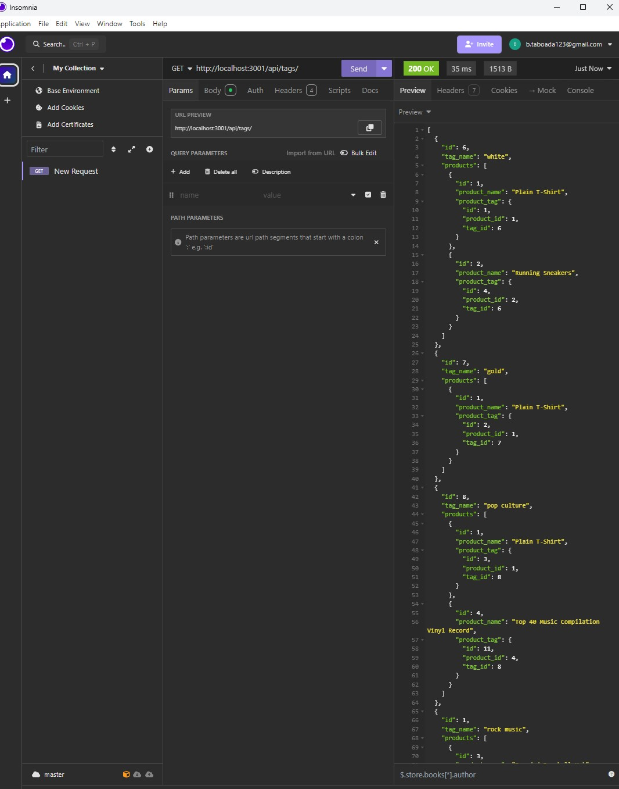

# E-Commerce Back End

## Description 
As E-commerce plays a significant role with in the electronic industry, I ventured to build a backend for a potential e-commerce website.  This is a CRUD application that uses sequalize to connect sql postgres to manage the database.

## Table of Contents
- [Installation](#installation)
- [Usage](#usage)
- [URL](#url)
- [Credits](#credits)
- [License](#license)
- [How to Contribute](#how-to-contribute)

## Installation
Clone the project from github (https://github.com/Taboada-B/E-Commerce-Back-End.git).  Create an .env file using the .env.Example format, enter you postgres password.  Open an integrated terminal at the root. run these commands: npm i, psql -U postgres, enter you personal password for postgres, \i db/schema.sql; , \q , node models/index.js, node seeds/index.js, node server.js.  Now the server will be listening on port 3001.  

## Usage
Now that the server is up and running, use insomnia to do GET, POST, PUT, DELETE calls.  There are comments to find the correct routing in routes/api/ folder.  http://localhost:3001/api should be the begining of all route calls.  

## URL
Video walkthrough url: https://youtu.be/xbrnKY07pMI

## Credits
NA

## License

This project is licensed under the MIT 
- see the following link for details: [MIT License](https://opensource.org/licenses/MIT)

## How to Contribute
Fork the repository to your own GitHub account. Clone the forked repository to your local machine. Create a new branch with a descriptive name: git checkout -b feature/your-feature-name. Make your changes or improvements in the new branch.
Test your changes to ensure they work as expected.
Commit and push your changes to your forked repository: git push origin feature/your-feature-name.
Open a Pull Request in the main repository with a clear description of your changes.
My github profile is: https://github.com/Taboada-B
